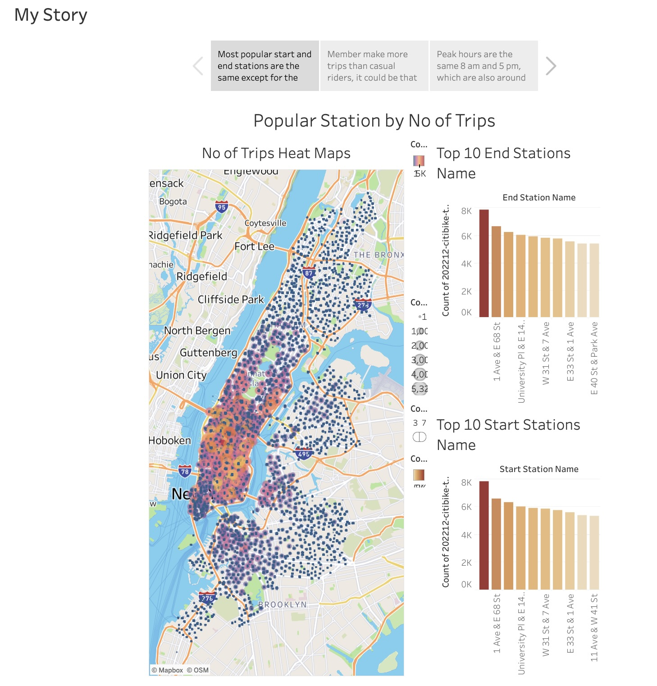
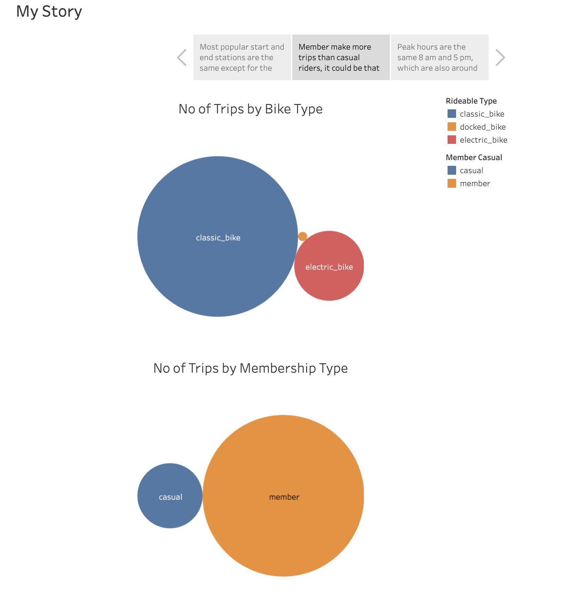
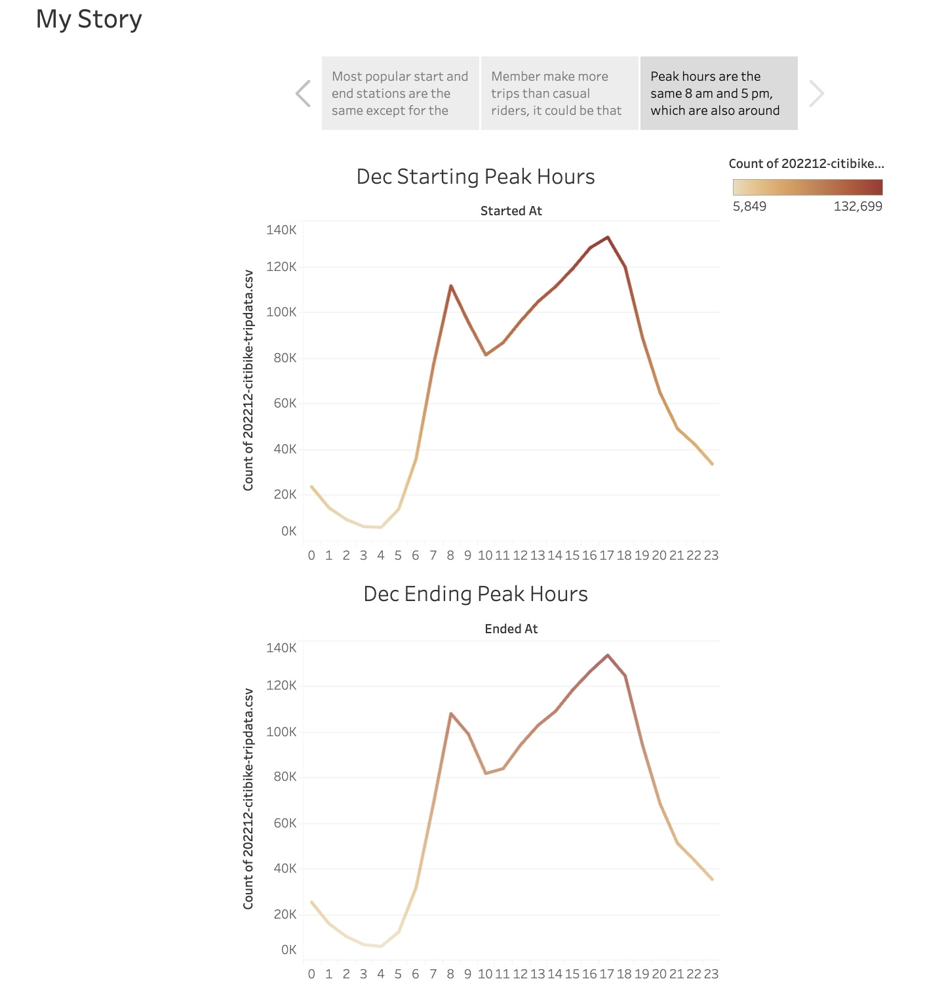

# CitiBike_With_Tableau

<tableau-viz id="tableauViz"       
  src='https://public.tableau.com/shared/2BPHNQRGR?:display_count=n&:origin=viz_share_link'      
  height='600px' width='600px' toolbar='bottom' hide-tabs>
</tableau-viz>

Here's the link to my visualization
https://public.tableau.com/shared/2BPHNQRGR?:display_count=n&:origin=viz_share_link

In my analysis on the New York Citi Bike program, I answered the following questions through my visualization:

-  What are the most popular starting and ending stations?
-  What are the peak hours?
-  What type of rider make the most trips?
-  What type pf bike are mostly used?
  

  

  

  

